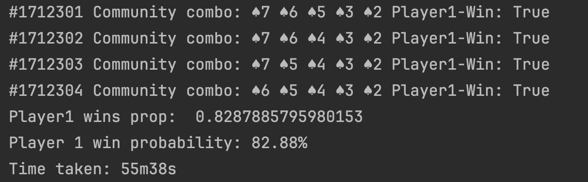
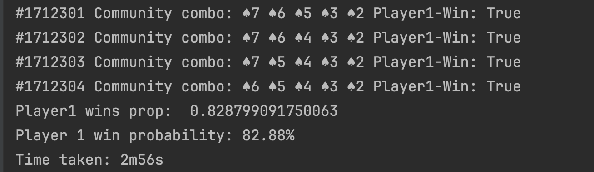
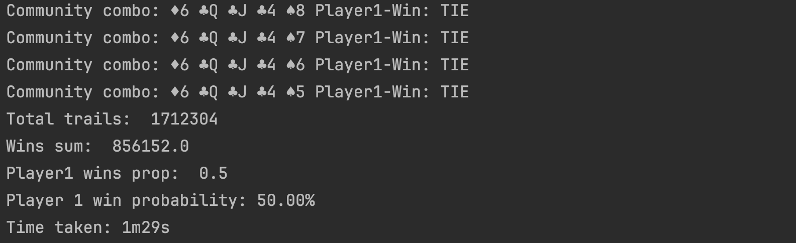
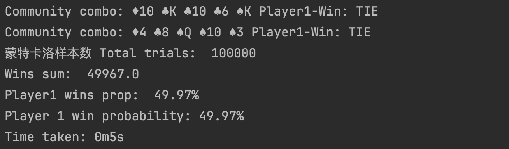

# texas-poker-computer

---

## Description

这个仓库旨在建立德州扑克规则的代码基础，并且构建一套能够使用不同的算法去计算手牌获胜概率的计算系统。

This repository aims to establish a codebase for Texas Hold'em rules and build a system capable of calculating hand
winning probabilities using various algorithms.

## MileStone

### Stage 1

能够使用遍历所有公共牌组合的办法，使用统计的方法去计算两个已知手牌的玩家的胜率。
这个方法非常缓慢，需要遍历的情况有 `C(48,5)=1,712,304` 种可能的公共牌。
此外，使用的Evaluator策略为Default的（遍历七张牌中所有可能的五张牌组合 `C(7,5)=21` ），
这意味着遍历的量级在千万级别。运行一次的时间在50min左右，有很大提升空间。

This method uses a statistical approach to calculate the win rate for two players with known hands by
traversing all combinations of community cards. This method is very slow, requiring traversal of
`C(48,5)=1,712,304` possible combinations of community cards.
Additionally, the Evaluator strategy used is the default one (traversing all possible five-card combinations from seven
cards `C(7,5)=21`), which means the scale of traversal is in the tens of millions.
The runtime is about 50 minutes, and there is significant room for improvement.



### Stage 2

使用完全规则的方法，设计了一个更好的七张牌判断牌型的 Evaluator，大幅度降低复杂度，运行一次的时间直接降低到了 3min 左右。

Using a method based on complete rules, a better Evaluator for determining hand types with seven cards has been
designed, significantly reducing complexity. The runtime has been directly reduced to about 3 minutes.



### Stage 3

使用多进程（并非多线程）的方法优化循环结构，大幅提高速度，运行一次的时间降到了 1m30s 左右。

By optimizing the loop structure with multiprocessing (not multithreading), the speed has been significantly increased,
reducing the runtime to about 1 minute and 30 seconds.



### Stage 4

增加蒙特卡洛模拟，使用样本量在 `100,000` 量级，误差可以基本控制在 `0.3%` 以下。
时间有了更大幅度提高，测试两个手牌相对的胜率，多进程的情况下，时间已经优化到`5s` 左右，是完全可以接受的了。

Monte Carlo simulations have been added, using a sample size of around 100,000, with the error generally controlled
below 0.3%. The time efficiency has significantly improved; testing the relative win rates of two hands, with
multiprocessing, the time has been optimized to about 5 seconds, which is entirely acceptable.



## Project

### Structure

```
src/
├── calculator/
│   ├── __init__.py
│   └── calculator.py
├── game/
│   ├── comparator/
│   │   ├── __init__.py
│   │   └── hand_comparator.py
│   ├── evaluator/
│   │   ├── __init__.py
│   │   ├── hand_rank.py
│   │   ├── hand_ranking.py
│   │   └── hand_ranking_evaluate.py
│   ├── __init__.py
│   ├── game.py
│   ├── player.py
│── poker/
│   ├── __init__.py
│   ├── deck.py
│   ├── poker.py
│   ├── rank.py
│   └── suit.py
├── __init__.py
└── main.py
```

### Module

* `poker`模块用于定义和描述扑克的点数和花色
* `game`模块定义了牌局的相关信息
* `evaluator`模块是计算一组牌中最大牌型的模块，可以实现和选取不同的策略
* `calculator`模块是胜率计算的模块，可以完成不同的情景的胜率计算

---

* The `poker` module is used to define and describe the ranks and suits of poker cards.
* The `game` module defines information related to the game.
* The `evaluator` module calculates the highest hand from a set of cards and allows for the implementation and selection
  of different strategies.
* The `calculator` module is responsible for calculating win probabilities under various scenarios.

### Unit Tests

项目使用单元测试保证所有规则的准确性以及运算的正确性。

The project uses unit testing to ensure the accuracy of all rules and the correctness of calculations

```shell
pytest tests
```